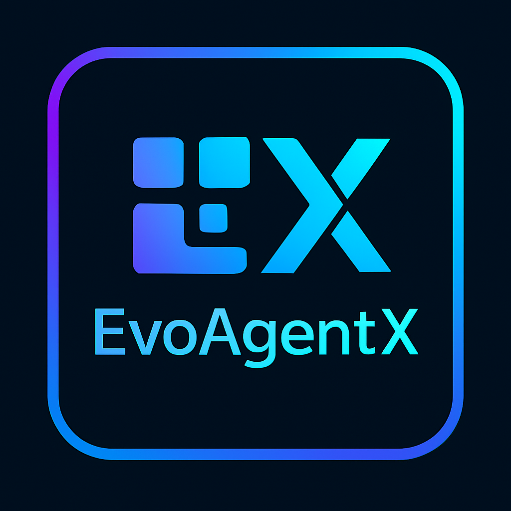

<!-- Add logo here -->
<div align="center">
  <a href="https://github.com/EvoAgentX/EvoAgentX">
    
  </a>
</div>

<h1 align="center">
    EvoAgentX:  构建自进化的 AI 智能体生态系统
</h1>

<div align="center">

[](https://EvoAgentX.github.io/EvoAgentX/)
[](https://discord.gg/EvoAgentX)
[](https://x.com/EvoAgentX)
[]()
[](https://huggingface.co/EvoAgentX)
[](https://star-history.com/#EvoAgentX/EvoAgentX)
[](https://github.com/EvoAgentX/EvoAgentX/blob/main/LICENSE)

</div>

<div align="center">

<h3 align="center">

[English](./README.md) | [简体中文](./README-zh.md) 

</h3>

</div>

<hr>

## 🔥 最新动态
- **[2025年5月]** 🎉 **EvoAgentX** 正式发布！

## ⚡开始使用
- [安装指南](#installation)
- [配置指南](#configuration)
- [示例：自动工作流生成](#examples-automatic-workflow-generation)
- [快速开始 & 演示视频](#quickstart--demo-video)
- [教程和使用案例](#tutorial-and-use-cases)

### 安装

请参阅 [EvoAgentX 安装指南](./docs/installation.md) 以获取详细的安装步骤。

创建环境：
1. 克隆此代码库并进入 EvoAgentX 文件夹
```bash
git clone https://github.com/EvoAgentX/EvoAgentX.git
cd EvoAgentX
```

2. 安装依赖包
```Shell
conda create -n evoagentx python=3.10 
conda activate evoagentx
pip install -r requirements.txt 
```

### 配置
Todos:
1. How to set up keys
2. others

### 示例：自动工作流生成
```python
from evoagentx.models import OpenAILLMConfig, OpenAILLM
from evoagentx.agents import AgentManager
from evoagentx.workflow import WorkFlowGenerator, WorkFlowGraph, WorkFlow

OPENAI_API_KEY = "OPENAI_API_KEY" 
# set output_response=True to see LLM outputs 
openai_config = OpenAILLMConfig(model="gpt-4o-mini", openai_key=OPENAI_API_KEY, stream=True, output_response=False)
model = OpenAILLM(config=openai_config)

agent_manager = AgentManager()
wf_generator = WorkFlowGenerator(llm=model)

# 生成工作流和智能体
workflow_graph: WorkFlowGraph = wf_generator.generate_workflow(goal="生成一个贪吃蛇游戏的python代码")

# [可选] 显示工作流
workflow_graph.display()
# [可选] 保存工作流 
workflow_graph.save_module("debug/workflow_demo.json")
#[可选] 加载已保存的工作流 
workflow_graph: WorkFlowGraph = WorkFlowGraph.from_file("debug/workflow_demo.json")

agent_manager.add_agents_from_workflow(workflow_graph)
# 执行工作流
workflow = WorkFlow(graph=workflow_graph, agent_manager=agent_manager, llm=model)
output = workflow.execute()
print(output)
```

### 快速开始 & 演示视频
Todos

请参阅[快速开始指南](./docs/quickstart.md) 以获得一步步的指导，帮助你快速上手 EvoAgentX。


### 教程和使用案例

探索如何有效地使用 EvoAgentX:

| Cookbook | Description |
|:---|:---|
| **[Build Your First Agent](./docs/tutorial/first_agent.md)** | A comprehensive guide to creating your first agent step-by-step. |
| **[Building Workflows Manually](./docs/tutorial/first_workflow.md)** | Learn how to design and implement collaborative agent workflows. |
| **[Benchmark and Evaluation Tutorial](./docs/tutorial/benchmark_and_evaluation.md)** | Guidelines for evaluating and benchmarking agent performance. |
| **[SEW Optimizer Tutorial](./docs/tutorial/sew_optimizer.md)** | Learn optimization techniques for enhancing agent workflows. |

🛠️ Follow the tutorials to build and optimize your EvoAgentX workflows.

💡 Discover real-world applications and unleash the potential of EvoAgentX in your projects!

## 🙋 Support

### Join the Community

📢 Stay connected and be part of the **EvoAgentX** journey!  
🚩 Join our community to get the latest updates, share your ideas, and collaborate with AI enthusiasts worldwide.

- [Discord](https://discord.com/invite/EvoAgentX) — Chat, discuss, and collaborate in real-time.
- [X (formerly Twitter)](https://x.com/EvoAgentX) — Follow us for news, updates, and insights.
- [WeChat]() — Connect with our Chinese community.

### Contact Information

If you have any questions or feedback about this project, please feel free to contact us. We highly appreciate your suggestions!

- **Email:** evoagentx.ai@gmail.com

We will respond to all questions within 2-3 business days.

## 🙌 Contributing to EvoAgentX
Thanks go to these awesome contributors

<a href="https://github.com/EvoAgentX/EvoAgentX/graphs/contributors">
  
</a>

We appreciate your interest in contributing to our open-source initiative. We provide a document of [contributing guidelines](https://github.com/clayxai/EvoAgentX/blob/main/CONTRIBUTING.md) which outlines the steps for contributing to EvoAgentX. Please refer to this guide to ensure smooth collaboration and successful contributions. 🤝🚀

[](https://www.star-history.com/#EvoAgentX/EvoAgentX&Date)


## 📄 License

Source code in this repository is made available under the [MIT License](./LICENSE).
